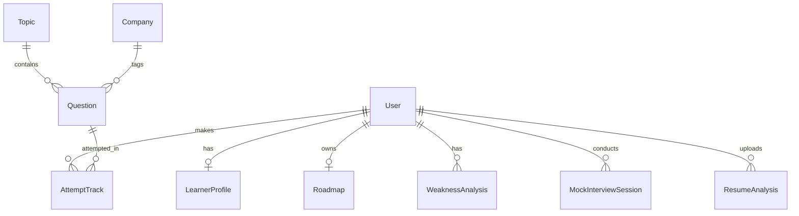

# System Architecture & Technical Proposal: AI Placement Coach

## 1. Requirements & Scope Analysis

### Core Principles & User Roles
The **AI Placement Coach** platform is designed strictly with **TWO user roles**:
1. **Student**: Learns, practices, takes mock tests/interviews, views personalized roadmap and analytics.
2. **Admin**: Manages curriculum, topics, questions, companies, platform analytics, student records, and AI prompts/configurations.

> [!IMPORTANT]
> **No Separate AI Teacher Roles or Portals**: AI Mentors (DSA Mentor, Aptitude Mentor, CS Core Mentor, Interview Coach, Career Coach) are contextual AI capabilities embedded directly inside the Student Experience. They do not have login credentials, admin panels, or separate role permissions.

### Core Student Modules (13 Pages/Modules)
1. **Student Dashboard**: Single unified overview (Roadmap preview, daily goals, streak, readiness score, recent activity).
2. **My AI Coach**: Centralized multi-turn conversational interface with subject persona switching.
3. **DSA Module**: Topic list, code editor (Monaco), problem statement, test cases, AI debugging assistant.
4. **Aptitude Module**: Topic wise quizzes, timed test environment, step-by-step AI solution explanation.
5. **CS Core Module**: DBMS, OS, Computer Networks, OOPs content, flashcards, conceptual quizzes.
6. **Practice Zone**: Filters by difficulty, company, tag; timed coding and MCQ challenges.
7. **Mock Interview**: Audio/Text conversational mock interviews with real-time feedback & rubric scoring.
8. **Company Preparation**: Company-specific tracks (TCS, Infosys, Amazon, Google, etc.), past questions, hiring patterns.
9. **Resume Analyzer**: ATS score breakdown, skill extraction, keyword gap identification via Gemini AI.
10. **My Progress**: Skill charts, topic mastery percentages, attempt breakdown over time.
11. **Weak Areas**: AI-detected weak topics, recommended remedial questions, concept refreshers.
12. **Achievements**: Badges, milestones, streaks, leaderboard position.
13. **Profile / Settings**: Target companies, target job roles, preferred languages, account management.

### Core Admin Modules (10 Pages/Modules)
1. **Admin Dashboard**: System health, active users, total submissions, overall readiness trends.
2. **Student Management**: View students, track individual performance, manage accounts.
3. **Question Management**: CRUD for DSA coding problems, MCQs, test cases, hints, difficulty.
4. **DSA Topic Management**: DSA modules, data structures, algorithm taxonomy, prerequisites.
5. **Aptitude Topic Management**: Quantitative, Logical, Verbal topic classification.
6. **CS Core Subject/Content Management**: Manage subjects, notes, syllabus, quiz banks.
7. **Company Management**: Company profiles, hiring criteria, test formats, pattern mapping.
8. **Resource Management**: External links, video references, cheatsheets, study materials.
9. **AI Configuration**: System prompts tuning, model temperature controls, token limits, fallback prompts.
10. **Platform Analytics**: Aggregate performance stats, most attempted questions, common error analytics.

---

## 2. Complete System Architecture

```
                                  +---------------------------------------+
                                  |            CLIENT LAYER               |
                                  | React + Vite + Tailwind CSS + Recharts|
                                  |         Monaco Code Editor            |
                                  +------------------+--------------------+
                                                     |
                                                     | HTTPS / REST / SSE
                                                     v
                                  +---------------------------------------+
                                  |            BACKEND LAYER              |
                                  |         Node.js + Express.js          |
                                  |   JWT Auth Middleware + RBAC Guard    |
                                  +---------+-----------------+-----------+
                                            |                 |
                   +------------------------+                 +------------------------+
                   |                                                                   |
                   v                                                                   v
     +---------------------------+                                       +---------------------------+
     |      DATABASE LAYER       |                                       |     EXTERNAL SERVICES     |
     | MongoDB + Mongoose ODM    |                                       |                           |
     | - Users & Profiles        |                                       | 1. Gemini API (Node SDK)  |
     | - Question Bank           |                                       |    - Personalization      |
     | - Attempt Records         |                                       |    - AI Mentors           |
     | - Performance Metrics     |                                       |    - Resume & Interview   |
     | - Personalised Roadmaps   |                                       | 2. External Code Sandbox  |
     +---------------------------+                                       |    - Code Execution API  |
                                                                         +---------------------------+
```

### Key Architectural Pillars
- **Single Page Application (SPA)** built with Vite + React.
- **RESTful API Backend** using Express.js.
- **Decoupled AI Layer**: Gemini API is strictly invoked server-side. Frontend makes secure API requests to Node.js backend endpoints, which construct secure system prompts and execute Gemini calls.
- **External Code Execution Engine**: Secure API proxy in Node backend connecting to an isolated sandbox (e.g. Judge0 / Piston execution engine API).

---

## 3. Proposed Frontend Folder Structure

```
client/
├── public/
│   └── favicon.ico
├── src/
│   ├── assets/
│   │   ├── icons/
│   │   └── images/
│   ├── components/
│   │   ├── common/
│   │   │   ├── Navbar.jsx
│   │   │   ├── Sidebar.jsx
│   │   │   ├── Footer.jsx
│   │   │   ├── Modal.jsx
│   │   │   ├── LoadingSpinner.jsx
│   │   │   ├── Badge.jsx
│   │   │   └── ProgressBar.jsx
│   │   ├── editor/
│   │   │   ├── MonacoEditor.jsx
│   │   │   ├── ConsoleOutput.jsx
│   │   │   └── TestCasesPanel.jsx
│   │   ├── charts/
│   │   │   ├── RadarChart.jsx
│   │   │   ├── AccuracyBarChart.jsx
│   │   │   └── ProgressLineChart.jsx
│   │   ├── ai/
│   │   │   ├── ChatDrawer.jsx
│   │   │   ├── PersonaSelector.jsx
│   │   │   └── CodeReviewCard.jsx
│   │   └── cards/
│   │       ├── QuestionCard.jsx
│   │       ├── CompanyCard.jsx
│   │       └── TopicCard.jsx
│   ├── context/
│   │   ├── AuthContext.jsx
│   │   ├── ThemeContext.jsx
│   │   └── AIContext.jsx
│   ├── hooks/
│   │   ├── useAuth.js
│   │   ├── useCodeRunner.js
│   │   ├── useAICoach.js
│   │   └── useProgress.js
│   ├── layouts/
│   │   ├── StudentLayout.jsx
│   │   ├── AdminLayout.jsx
│   │   └── AuthLayout.jsx
│   ├── pages/
│   │   ├── auth/
│   │   │   ├── Login.jsx
│   │   │   └── Register.jsx
│   │   ├── student/
│   │   │   ├── Dashboard.jsx
│   │   │   ├── MyAICoach.jsx
│   │   │   ├── DSAModule.jsx
│   │   │   ├── AptitudeModule.jsx
│   │   │   ├── CSCoreModule.jsx
│   │   │   ├── PracticeZone.jsx
│   │   │   ├── ProblemDetail.jsx
│   │   │   ├── MockInterview.jsx
│   │   │   ├── CompanyPrep.jsx
│   │   │   ├── ResumeAnalyzer.jsx
│   │   │   ├── MyProgress.jsx
│   │   │   ├── WeakAreas.jsx
│   │   │   ├── Achievements.jsx
│   │   │   └── ProfileSettings.jsx
│   │   └── admin/
│   │       ├── AdminDashboard.jsx
│   │       ├── StudentManagement.jsx
│   │       ├── QuestionManagement.jsx
│   │       ├── DSATopicManagement.jsx
│   │       ├── AptitudeTopicManagement.jsx
│   │       ├── CSCoreManagement.jsx
│   │       ├── CompanyManagement.jsx
│   │       ├── ResourceManagement.jsx
│   │       ├── AIConfiguration.jsx
│   │       └── PlatformAnalytics.jsx
│   ├── services/
│   │   ├── api.js
│   │   ├── authService.js
│   │   ├── dsaService.js
│   │   ├── aiService.js
│   │   ├── codeService.js
│   │   └── adminService.js
│   ├── routes/
│   │   ├── AppRoutes.jsx
│   │   ├── ProtectedRoute.jsx
│   │   └── AdminRoute.jsx
│   ├── utils/
│   │   ├── constants.js
│   │   ├── formatters.js
│   │   └── validators.js
│   ├── App.jsx
│   ├── index.css
│   └── main.jsx
├── index.html
├── package.json
├── tailwind.config.js
└── vite.config.js
```

---

## 4. Proposed Backend Folder Structure

```
server/
├── config/
│   ├── db.js
│   ├── gemini.js
│   └── env.js
├── src/
│   ├── controllers/
│   │   ├── authController.js
│   │   ├── studentController.js
│   │   ├── dsaController.js
│   │   ├── aptitudeController.js
│   │   ├── csCoreController.js
│   │   ├── practiceController.js
│   │   ├── interviewController.js
│   │   ├── companyController.js
│   │   ├── resumeController.js
│   │   ├── aiController.js
│   │   └── admin/
│   │       ├── studentAdminController.js
│   │       ├── questionAdminController.js
│   │       ├── topicAdminController.js
│   │       ├── companyAdminController.js
│   │       ├── aiConfigAdminController.js
│   │       └── analyticsAdminController.js
│   ├── middleware/
│   │   ├── authMiddleware.js
│   │   ├── roleMiddleware.js
│   │   ├── errorMiddleware.js
│   │   ├── rateLimiter.js
│   │   └── validateRequest.js
│   ├── models/
│   │   ├── User.js
│   │   ├── LearnerProfile.js
│   │   ├── Roadmap.js
│   │   ├── Topic.js
│   │   ├── Question.js
│   │   ├── AttemptTrack.js
│   │   ├── WeaknessAnalysis.js
│   │   ├── MockInterviewSession.js
│   │   ├── ResumeAnalysis.js
│   │   ├── Company.js
│   │   ├── Achievement.js
│   │   └── AIConfig.js
│   ├── routes/
│   │   ├── authRoutes.js
│   │   ├── studentRoutes.js
│   │   ├── dsaRoutes.js
│   │   ├── aptitudeRoutes.js
│   │   ├── csCoreRoutes.js
│   │   ├── interviewRoutes.js
│   │   ├── companyRoutes.js
│   │   ├── resumeRoutes.js
│   │   ├── aiRoutes.js
│   │   └── adminRoutes.js
│   ├── services/
│   │   ├── ai/
│   │   │   ├── geminiClient.js
│   │   │   ├── promptTemplates.js
│   │   │   ├── personaPrompts.js
│   │   │   ├── resumeParser.js
│   │   │   ├── interviewEvaluator.js
│   │   │   └── recommendationEngine.js
│   │   └── sandbox/
│   │       └── codeExecutionService.js
│   └── utils/
│       ├── apiResponse.js
│       ├── apiError.js
│       └── helpers.js
├── package.json
└── server.js
```

---

## 5. Database Collections & Schema Relationships



### Primary Collections & Schema Highlights

#### 1. `users` Collection
- `_id`: ObjectId
- `name`: String
- `email`: String (unique, indexed)
- `passwordHash`: String
- `role`: Enum `['student', 'admin']` (default: `'student'`)
- `targetCompanies`: Array of String
- `targetRole`: String (e.g. "Software Engineer", "Frontend Developer")
- `createdAt`, `updatedAt`: Date

#### 2. `learnerprofiles` Collection
- `_id`: ObjectId
- `userId`: ObjectId (ref: `User`, unique index)
- `currentSkillLevel`: Enum `['Beginner', 'Intermediate', 'Advanced']`
- `dsaMastery`: Number (0-100)
- `aptitudeMastery`: Number (0-100)
- `csCoreMastery`: Number (0-100)
- `readinessScore`: Number (0-100 overall score)
- `currentStreak`: Number
- `longestStreak`: Number
- `totalProblemsSolved`: Number
- `totalTimeSpentMinutes`: Number

#### 3. `topics` Collection
- `_id`: ObjectId
- `category`: Enum `['dsa', 'aptitude', 'cs_core']`
- `subject`: String (e.g. "DBMS", "Arrays", "Quantitative Aptitude")
- `title`: String
- `slug`: String (unique)
- `order`: Number
- `prerequisites`: Array of ObjectId (ref: `Topic`)
- `description`: String

#### 4. `questions` Collection
- `_id`: ObjectId
- `topicId`: ObjectId (ref: `Topic`, indexed)
- `title`: String
- `slug`: String (unique)
- `difficulty`: Enum `['Easy', 'Medium', 'Hard']`
- `type`: Enum `['coding', 'mcq', 'conceptual']`
- `problemStatement`: String
- `inputFormat`: String
- `outputFormat`: String
- `constraints`: String
- `codeSnippets`: Object (languages: `{ cpp: "", java: "", python: "", javascript: "" }`)
- `testCases`: Array of `{ input: String, expectedOutput: String, isHidden: Boolean }`
- `mcqOptions`: Array of `{ optionId: String, text: String, isCorrect: Boolean }`
- `solutionExplanation`: String
- `companyTags`: Array of String

#### 5. `attempttracks` Collection
- `_id`: ObjectId
- `userId`: ObjectId (ref: `User`, indexed)
- `questionId`: ObjectId (ref: `Question`, indexed)
- `category`: Enum `['dsa', 'aptitude', 'cs_core']`
- `submittedCode`: String
- `language`: String
- `status`: Enum `['Accepted', 'Wrong Answer', 'Time Limit Exceeded', 'Runtime Error', 'Compile Error']`
- `passedTestCases`: Number
- `totalTestCases`: Number
- `timeSpentSeconds`: Number
- `hintsUsedCount`: Number
- `aiFeedbackSummary`: String
- `createdAt`: Date

#### 6. `roadmaps` Collection
- `_id`: ObjectId
- `userId`: ObjectId (ref: `User`, unique index)
- `nodes`: Array of `{ nodeId: String, topicId: ObjectId, status: Enum['locked', 'in_progress', 'completed'], priorityScore: Number, estimatedHours: Number }`
- `lastGeneratedAt`: Date
- `version`: Number

#### 7. `weaknessanalyses` Collection
- `_id`: ObjectId
- `userId`: ObjectId (ref: `User`, indexed)
- `topicId`: ObjectId (ref: `Topic`)
- `category`: String
- `failureCount`: Number
- `accuracyPercentage`: Number
- `identifiedPattern`: String (e.g. "Off-by-one errors in binary search", "Memory limit exceeded in Recursion")
- `severity`: Enum `['High', 'Medium', 'Low']`
- `remedialQuestionIds`: Array of ObjectId (ref: `Question`)
- `updatedAt`: Date

#### 8. `mockinterviewsessions` Collection
- `_id`: ObjectId
- `userId`: ObjectId (ref: `User`, indexed)
- `roleType`: String
- `companyContext`: String
- `durationMinutes`: Number
- `transcript`: Array of `{ speaker: Enum['ai', 'student'], message: String, timestamp: Date }`
- `evaluation`: `{ technicalScore: Number, communicationScore: Number, problemSolvingScore: Number, detailedFeedback: String, strengths: [String], improvements: [String] }`
- `createdAt`: Date

#### 9. `resumeanalyses` Collection
- `_id`: ObjectId
- `userId`: ObjectId (ref: `User`, indexed)
- `atsScore`: Number
- `extractedSkills`: Array of String
- `missingKeywords`: Array of String
- `formattingFeedback`: String
- `recommendedActionItems`: Array of String
- `createdAt`: Date

#### 10. `companies` Collection
- `_id`: ObjectId
- `name`: String (unique)
- `logoUrl`: String
- `description`: String
- `hiringRounds`: Array of `{ roundName: String, roundType: String, description: String }`
- `syllabus`: Array of String
- `cutoffBenchmark`: Number

#### 11. `aiconfigs` Collection
- `_id`: ObjectId
- `personaName`: String (e.g., "DSA Mentor", "Interview Coach")
- `systemPrompt`: String
- `temperature`: Number
- `maxTokens`: Number
- `modelName`: String (e.g. "gemini-2.5-flash")
- `isActive`: Boolean

---

## 6. Proposed API Module Structure

All APIs are versioned under `/api/v1`.

### 6.1 Authentication (`/api/v1/auth`)
- `POST /register`: Register student account.
- `POST /login`: Authenticate and issue JWT.
- `GET /me`: Fetch authenticated user credentials and role.

### 6.2 Student Dashboard & Profile (`/api/v1/student`)
- `GET /dashboard`: Aggregate overview (Roadmap, readiness score, daily goal, recent attempts).
- `GET /profile`: Fetch student profile.
- `PUT /profile`: Update target companies, role preferences.
- `GET /roadmap`: Retrieve personalized learning roadmap.
- `POST /roadmap/recalculate`: Manually trigger roadmap updating.
- `GET /progress`: Detailed analytics across DSA, Aptitude, CS Core.
- `GET /weak-areas`: Fetch weak topics with AI diagnosis.
- `GET /achievements`: Student badges, streaks, and milestones.

### 6.3 DSA Module (`/api/v1/dsa`)
- `GET /topics`: List DSA topics with user progress.
- `GET /questions`: Filter DSA questions by topic, difficulty.
- `GET /questions/:slug`: Fetch detailed problem statement.
- `POST /submit`: Run code against sandbox test cases and store attempt.
- `POST /ai-hint`: Request contextual hint from DSA Mentor AI.

### 6.4 Aptitude Module (`/api/v1/aptitude`)
- `GET /topics`: Aptitude topics list.
- `GET /quiz/:topicId`: Fetch generated aptitude test.
- `POST /quiz/submit`: Submit quiz answers, record accuracy.
- `POST /ai-explain`: Request step-by-step AI explanation for missed questions.

### 6.5 CS Core Module (`/api/v1/cs-core`)
- `GET /subjects`: DBMS, OS, CN, OOPs content categories.
- `GET /topics/:subjectId`: Core concepts and flashcards.
- `POST /quiz/submit`: Submit conceptual test.

### 6.6 Practice & Company Prep (`/api/v1/practice`, `/api/v1/company`)
- `GET /practice/filter`: Universal search & filter across all questions.
- `GET /companies`: List supported target companies.
- `GET /companies/:companyId`: Detailed company hiring pattern & tagged questions.

### 6.7 Mock Interview & Resume Analyzer (`/api/v1/interview`, `/api/v1/resume`)
- `POST /interview/start`: Initialize mock interview session.
- `POST /interview/turn`: Send student transcript audio/text turn, receive AI interviewer response.
- `POST /interview/finish`: End interview and generate rubric feedback report.
- `POST /resume/analyze`: Upload resume (PDF), invoke Gemini resume evaluator.

### 6.8 AI Services Proxy (`/api/v1/ai`)
- `POST /coach/chat`: Send user prompt with current topic persona to AI Coach.

### 6.9 Admin Modules (`/api/v1/admin`)
- `GET /dashboard`: System stats (Total users, completion rates, error trends).
- `GET /students`: List and search students.
- `GET /students/:studentId`: View deep-dive performance report of student.
- `POST/PUT/DELETE /questions`: Full CRUD for question bank.
- `POST/PUT/DELETE /topics`: Full CRUD for topics across DSA, Aptitude, CS Core.
- `POST/PUT/DELETE /companies`: Full CRUD for company prep modules.
- `GET/PUT /ai-config`: Manage AI system prompts, parameters, and personas.

---

## 7. Proposed AI Service Architecture

```
                                  +---------------------------------------+
                                  |         Express AI Controller         |
                                  +-------------------+-------------------+
                                                      |
                                                      v
                                  +---------------------------------------+
                                  |           AIService Manager           |
                                  | (Gemini Node.js SDK Wrapper)          |
                                  +-------------------+-------------------+
                                                      |
                       +------------------------------+------------------------------+
                       |                              |                              |
                       v                              v                              v
        +----------------------------+  +----------------------------+  +----------------------------+
        |   Persona Prompt Builder   |  |   Structured Data Parser   |  |    Token & Safety Guard    |
        | - DSA Mentor               |  | - JSON Schema Enforcement  |  | - Rate limiting            |
        | - Aptitude Mentor          |  | - Markdown Parser          |  | - Context Truncation       |
        | - CS Core Mentor           |  +----------------------------+  +----------------------------+
        | - Interview Coach          |                                
        | - Career Coach             |                                
        +----------------------------+                                
```

### AI Component Architecture
1. **Central `AIService` Wrapper**: Encapsulates Gemini API calls using `@google/genai` Node SDK.
2. **Contextual Persona Injection**:
   - **DSA Mentor**: Focuses on algorithmic hints, logic debugging, space/time complexity analysis without giving direct full solutions right away.
   - **Aptitude Mentor**: Focuses on shortcut formulas, step-by-step mathematical reasoning, and error analysis.
   - **CS Core Mentor**: Delivers concise conceptual explanations with real-world software engineering analogies.
   - **Interview Coach**: Conducts conversational turn-taking, asks follow-up technical questions, and scores responses against an evaluation rubric.
   - **Career Coach**: Analyzes resumes, matches resume keywords against target company profiles, and suggests high-impact resume edits.
3. **Structured JSON Output Schema**: Uses Gemini's native `responseSchema` or explicit JSON prompt constraints for structured outputs (e.g. quiz generation, weakness classification, evaluation rubrics).
4. **Streaming (SSE)**: Uses Gemini `generateContentStream` for real-time response streaming in the AI Coach chat and Mock Interview interface.

---

## 8. Personalization Engine & Performance Data Flow

The Personalization Engine operates as an adaptive feedback loop:

```
[ Student Assessment ] 
         │
         ▼
[ Learner Profile ] ──────────────► [ Personalized Roadmap Created ]
                                                   │
                                                   ▼
[ Updated Personalized Roadmap ] ◄─────── [ Learning & Practice ]
         │                                         │
         │                                         ▼
         │                                [ Attempt Tracking ]
         │                                 (Accuracy, Time, Hints)
         │                                         │
         │                                         ▼
         │                               [ Performance Analysis ]
         │                                         │
         │                                         ▼
         │                               [ Weakness Detection ]
         │                                         │
         │                                         ▼
         └─────────────────────────── [ Recommendation Engine ]
                                                   │
                                                   ▼
                                      [ Mock Placement Simulation ]
                                                   │
                                                   ▼
                                      [ Final Readiness Report ]
```

### Step-by-Step Personalization Logic
1. **Initial Assessment**: New students complete a diagnostic test or state their target job role (e.g., SDE-1 at Amazon).
2. **Roadmap Generation**: Engine generates a custom node graph of topics (DSA, Aptitude, CS Core) ordered by prerequisite dependencies and company priority weightage.
3. **Attempt Tracking**: Every submission logs:
   - Status (Passed/Failed)
   - Execution Time & Memory Efficiency
   - Time spent on problem
   - Number of hints requested
4. **Performance Analysis**: Calculates rolling topic accuracy:
   $$\text{Mastery Score} = (\text{Accuracy} \times 0.6) + (\text{Speed Factor} \times 0.2) + (\text{Independence Factor} \times 0.2)$$
5. **Weakness Detection**: If a topic accuracy drops below 60% or multiple consecutive submissions fail with similar runtime/logic errors:
   - System flags topic as a **Weak Area**.
   - Gemini classifies the exact misconception (e.g. "Lacks dynamic programming state transition understanding").
6. **Dynamic Recommendation**: The engine automatically inserts remedial questions and micro-lessons into the student's active roadmap.
7. **Placement Readiness Score**: Aggregates DSA, Aptitude, CS Core, and Mock Interview scores to provide a single percentage readiness score for their target companies.

---

## 9. Data Flow Across Components

### Practice & Code Submission Data Flow Example

```
+----------+             +----------+             +----------+             +-------------+             +------------+
| Frontend |             | Backend  |             | External |             |  MongoDB    |             | Gemini API |
| (React)  |             | (Express)|             | Sandbox  |             |             |             |            |
+----+-----+             +----+-----+             +----+-----+             +------+------+             +-----+------+
     |                        |                        |                          |                          |
     | 1. Submit Code         |                        |                          |                          |
     +----------------------->|                        |                          |                          |
     |                        | 2. Run Test Cases      |                          |                          |
     |                        +----------------------->|                          |                          |
     |                        | 3. Execution Result    |                          |                          |
     |                        |<-----------------------+                          |                          |
     |                        |                                                   |                          |
     |                        | 4. Record Attempt & Update Mastery Stats          |                          |
     |                        +-------------------------------------------------->|                          |
     |                        |                                                   |                          |
     |                        | 5. If failed: Send code & error log for analysis   |                          |
     |                        +----------------------------------------------------------------------------->|
     |                        | 6. AI Diagnosis & Debugging Hint                                             |
     |                        |<-----------------------------------------------------------------------------+
     |                        |                                                   |                          |
     | 7. Return Result & Hint|                                                   |                          |
     |<-----------------------+                                                   |                          |
```

---

## 10. Architectural Risks & Critical Decisions to Finalize

### Decision 1: Code Execution Engine Choice
- **Options**:
  - *Option A*: Third-party hosted Judge0 / Piston API (Faster startup, no container maintenance, usage cost).
  - *Option B*: Self-hosted Judge0 Docker container on cloud instance (Full control, lower per-request cost, requires infra maintenance).
- **Recommendation**: Start with Option A (Rapid development using Judge0 / Piston API wrapper) with an abstraction service layer (`codeExecutionService.js`) so we can easily swap to self-hosted later.

### Decision 2: Streaming vs HTTP REST for AI Coach & Interviews
- **Recommendation**: Use **Server-Sent Events (SSE)** or WebSockets for AI chat and interview turn-taking to deliver immediate streaming tokens to React without UI blocking.

### Decision 3: AI Rate Limiting & Cost Mitigation
- **Risk**: Unrestricted Gemini API usage by students could cause token quota exhaustion.
- **Mitigation**:
  - Implement Redis/In-Memory backend rate limiting middleware (`rateLimiter.js`) per user.
  - Set maximum token limits on response generation in backend Gemini configs.
  - Cache static AI responses (such as standard problem solution breakdowns or static topic explanations) in MongoDB.

### Decision 4: Role Isolation & Authorization Security
- **Risk**: Unauthorized access to Admin APIs by students.
- **Mitigation**: Strict JWT verification middleware checking `req.user.role === 'admin'` on all `/api/v1/admin/*` endpoints.

---

## Verification & Next Steps

### Proposed Verification Strategy
1. **Directory Validation**: Ensure frontend and backend directory trees match the clean modular layout.
2. **Schema Verification**: Validate Mongoose schemas against relational constraints and performance indexing requirements.
3. **API Contract Verification**: Ensure API route specifications match frontend consumption requirements.

> [!NOTE]
> Please review this system architecture proposal. Upon your approval, we will proceed with setting up the project baseline and building out the core models, routes, and UI components step by step.
